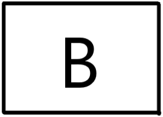
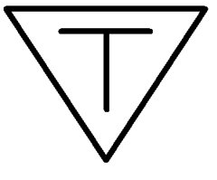
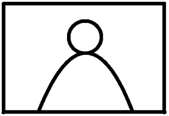
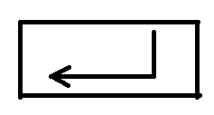

  
<h1 align="center"> Freehand IO </h1>
<h4 align="center">:boom:An intuitive platform to create Website Frontend using Hand Drawn:pencil2: Sketches. </h4>
<h4 align="center">Live @ <a href="https://freehand.ml/">https://freehand.ml/</a>  </h4>

  
 

---------------------------------------

## About 

 -   We are using Machine Learning to Detect and to Generate Frontend Code for Various Components in  Website.
-    Give us Simple Hand Drawn sketch of how Website should look and we will give you its code .:smiley:
-    So get up and draw your website , we got you covered .
- This repo contains code for our [Website](https://freehand.ml/) 

## Features
 - Currently we can detect and code 4 components.
    - Buttons :white_check_mark:
    - Text Box :white_check_mark:
    - Image :white_check_mark:
    - Input Field :white_check_mark:
 - Specific things to draw for these components are 
    - ` Button` 
    
       
      
     - `Text Box` 
     
          
      
    - `Image` 
    
       
      
    - `Input Field ` 
    
       
      
  - Draw these on white blank paper and take an clear image of it. Upload it on Freehand IO . More Detailed Documentation can be found .[here](https://freehand.ml/docuFF/documentation.html)
  - Once Detected, You can Customise these components and add specific things to it.
  - Proceed to Code Generation and , :boom: Your Code is ready .
  - You can also download your HTML files .
  

## Demo

 

----------------------------------------------------- 
## Implemnetation

- We are using YOLO model and Transfer Learning to train it to our custom Images.
- We have trained our ML Model to detect these components.
- Using this Model we are detecting these Components in Image .
- And with these Deatils we are then generating Code Using Node.js .

## Contributing
- We're are open to `enhancements` & `bug-fixes`.
- Feel free to add issues and submit patches.
  
## Authors
  - Atharva Udapure - [atharvau](https://github.com/atharvau)
  - Nikhil Sahu - [nikhildsahu](https://github.com/nikhildsahu)
  - Gaurav Sharma - [gauravgs](https://github.com/gauravgs)
- Saket Gulhane - [th-10](https://github.com/th-10)
- Saksham Madan - [sakshammadan](https://github.com/sakshammadan)
