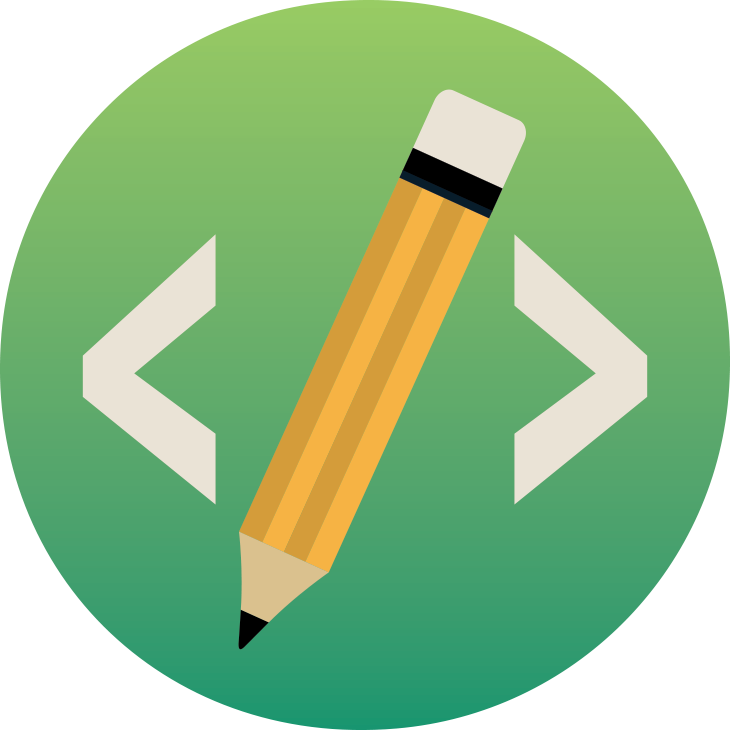

  
<h1 align="center"> Freehand IO </h1>
<h4 align="center">An intuitive platform to create Website Frontend using Hand Drawn Sketches. </h4>
<h4 align="center">Live @ <a href="https://freehand.ml/">https://freehand.ml/</a>  </h4>

  
 

## Demo

 
</p
  
## Authors

- Atharva Udapure - [atharvau](https://github.com/atharvau)
- Nikhil Sahu - [nikhildsahu](https://github.com/nikhildsahu)
- Gaurav Sharma - [gauravsharma-gs](https://github.com/gauravsharma-gs)
- Saket Gulhane - [th-10](https://github.com/th-10)
- Saksham Madan - [sakshammadan](https://github.com/sakshammadan)
